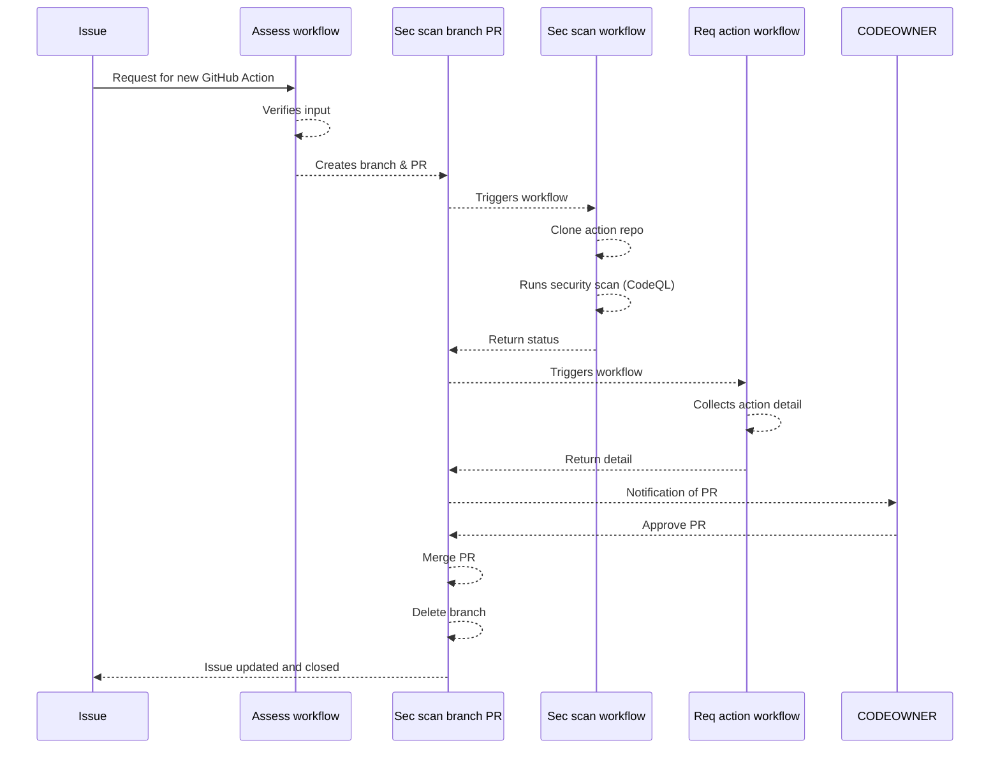

# github-org-action-requester

# THIS IS A WIP

Repository for managing request for GitHub Actions in a GitHub Organization. 

It works with [github-actions-allow-list-as-code-action](https://github.com/ActionsDesk/github-actions-allow-list-as-code-action) to update the allow list for GitHub Actions across a GitHub Org after running a set of security tooling and actions against requested action.

## Sequence diagram

# Requirements

* This repo requires a PAT with Organisation admin rights to be added as a secret to the repo. The PAT is used to create a branch and PR to update the allow list for GitHub Actions across a GitHub Org.
* Access to CodeQL scanning on GitHub (Eg public repository or GHAS license)
* 
